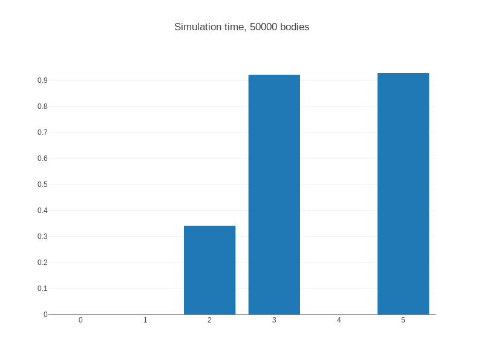

# opencl-nbody
This repository contains all the OpenCL code and the report for the lab course "Parallel Programmeren" by Joost Vennekens and Wiebe Van Ranst (campus De Nayer, KU Leuven).

## Who are we?
- [Simon Vandevelde](https://github.com/Salt-Factory)
- [Dylan Van Assche](https://github.com/DylanVanAssche)

## N-body problem
The N-body problem is a well known physics problem where we want to predict the individual motions of a group of celestial objects interacting with each other gravitationally. You can find more information about this on [Wikipedia.org](https://en.wikipedia.org/wiki/N-body_problem)

To calculate all these motions a lot of computer power is needed if you have a lot of bodies. When using OpenCL we can use the GPU to calculate all the motions of the bodies in parallel.

## Performance
We tested several methods and OpenCL kernels, we hit the limit with our current implementation at 50 000 bodies.

- Kernel 0: CPU version, fails to start
- Kernel 1 & 4: OpenCL kernel where only a small for lus is running on the GPU, fails to start (calculates the new position)
- Kernel 3: OpenCL kernel wehere a big for lus is running on the GPU (calculates the new speed)
- Kernel 5: Combines the OpenCL kernels 1 & 3 without optimising the data transfer (due time limit)

_As you can see, the 3rd and 5th kernels are still running smoothly with only a frame time of 0.9 seconds! The CPU calculated 5 000 bodies in 0.6 seconds. You can find more benchmarks in `report.pdf` (Dutch only)._

:bulb: If we had more time, we could optimize several things for the 5th kernel like: data transfers, memory types, ... to icnrease the performance.

## Build instructions

1. Clone this repo using `git clone`.
2. Enter the directory: `cd opencl-nbody`
3. Set the right kernel and n-body mode in the MakeFile and run `make`
4. Launch it: `./n-body [NUMBER OF BODIES]`
